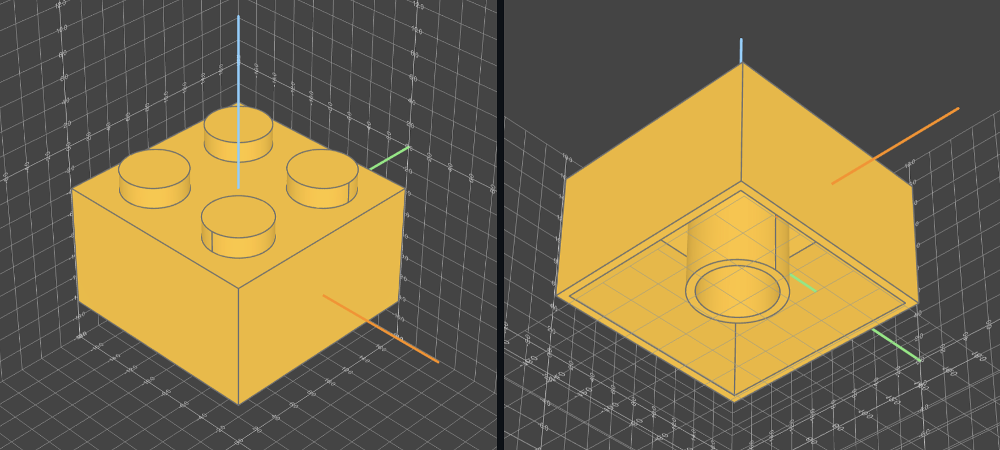

# Oden - Design with Code, not Complexity

Oden is a programming language for 3D modelling. Designing hardware products using a code-first approach makes recurring issues with 3D modelling trivial
- Parametric design by default - quickly iterate over hundred of designs to identify the most optimal model
- Trivial LLM support - integrate AI into your design workflows, from simple debugging support to full on AI-driven design
- Easy version control using git - the industry standard in software development used in the largest software projects ever created
- Infinite scalability – standard software practices allow projects to scale to the largest systems ever created, with Oden you can use the same practices in 3D modeling

In Oden, the code
```oden
// A 2x2 lego brick with the default dimensions
part LegoBrick2x2:
    block_width = 16mm
    block_height = 9.6mm
    stud_height = 11.2mm - block_height
    stud_distance = 8mm
    stud_diameter = 4.8mm
    thickness = 1.2mm
    tube_diameter = 6.5mm
    tube_height = block_height - 2 * thickness

    part.add(Cuboid(block_width, block_width, block_height))
    part.add(
        Cylinder(stud_diameter / 2, stud_height)
            .move_to(stud_distance / 2, stud_distance / 2, (block_height + stud_height) / 2)
            .circular_pattern(Axis.Z(), 4)
    )
    part.subtract(
        Cuboid(block_width - thickness, block_width - thickness, block_height)
            .move_to(0m, 0m, thickness * -1)
    )
    inner_tube = Cylinder(tube_diameter / 2, tube_height)
        .subtract(Cylinder((tube_diameter - thickness) / 2, tube_height))
        .move_to(0m, 0m, thickness * -1)

    part.add(inner_tube)
```
results in


# Principles

Oden is optimized for productivity. To ensure a great user experience we have designed the language based on the following principles:
- Optimal readibility - with a Python-like syntax and method names from the 3D modeling domain, Oden is designed to read like somebody is describing how a model is built to you
- Designed around units - Oden is fundamentally based around real-life units preventing scale-guessing and incidents like the [Mars Climate Orbiter](https://sma.nasa.gov/docs/default-source/safety-messages/safetymessage-2009-08-01-themarsclimateorbitermishap.pdf?sfvrsn=eaa1ef8_4)